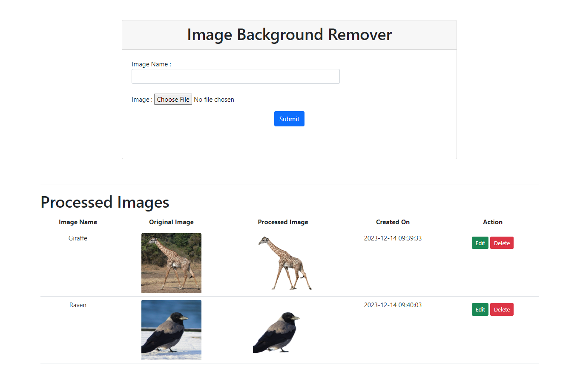
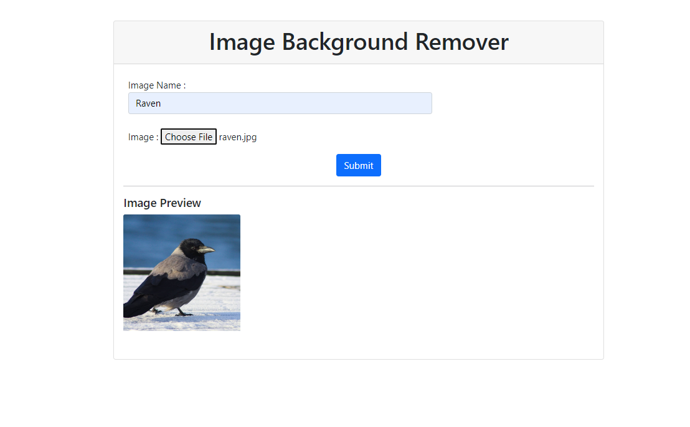
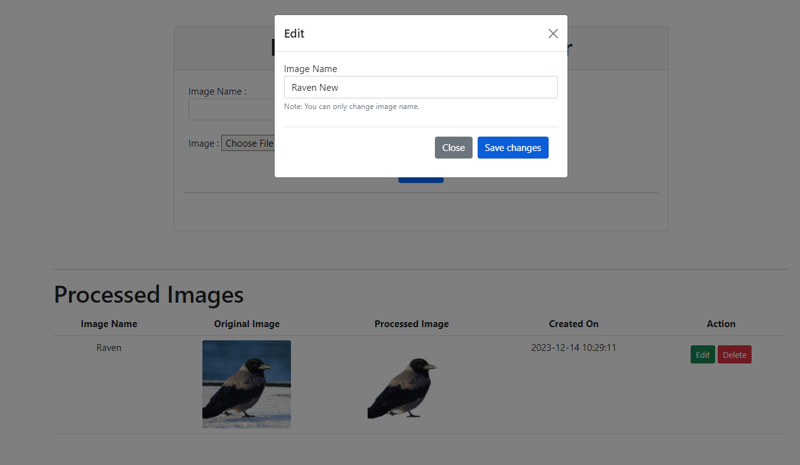
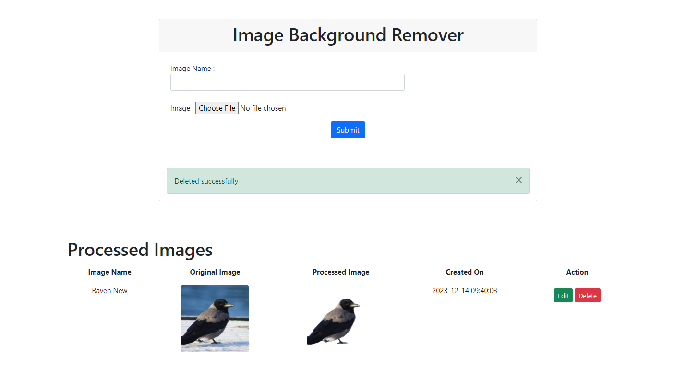

# image-background-processor

A REST-API application built with Flask Framework

---

### Virtual Environment Setup

| **Windows Commands** | **Linux Commands** |
|----------------------|--------------------|
| 1. `py -m pip install --upgrade pip` | 1. `python3 -m pip install --user --upgrade pip` |
| 2. `py -m pip install --user virtualenv` | 2. `python3 -m pip install --user virtualenv` |
| 3. `py -m venv env` | 3. `python3 -m venv ./venv` |
| 4. `.\env\Scripts\activate` (command to activate venv) | 4. `source ./venv/bin/activate` (command to activate venv) |
| 5. `deactivate` (command to deactivate venv) | 5. `deactivate` (command to deactivate venv) |

---

### Installing Packages
`pip install -r requirements.txt`

### Create .env
Create a file named `.env` ; copy contents from `.env.example` and replace them with your key-value pairs

---

### Run Flask Application Using
1. `export FLASK_APP=app.py`
2. `export FLASK_ENV=development`  (Use this command in development phase)
3. `flask run`

---

# Project Directory Structure

```
.
├── app
│   ├── api_connections.py
│   ├── config.py
│   ├── db_connections.py
│   ├── __init__.py
│   ├── kubernetes
│   │   ├── configmap.yaml
│   │   ├── deployment.yaml
│   │   └── service.yaml
│   └── templates
│       ├── base_template.html
│       ├── flash_message.html
│       └── index.html
├── assets
│   ├── delete_data.png
│   ├── edit_data.png
│   ├── get_home.png
│   ├── upload_image.png
│   └── upload_success.png
├── Dockerfile
├── LICENSE
├── README.md
├── requirements.txt
└── venv
```

---
# Application Overview

### Home Page


### Add Data



### Edit Data


### Delete Data


---

# API Documentation

## Connection Health Check

### Endpoint

- **URL**: `/health`
- **Method**: GET

### Description

This endpoint checks the health status of the connection.

### Response

- **Status Code**: 200 OK
- **Response Body**:
    ```json
    {
        "status": "Healthy"
    }
    ```

---

## Read Data

### Endpoint

- **URL**: `/`
- **Method**: GET

### Description

This endpoint serves an index page. It performs the following actions:

1. If the user's cookies do not contain a `"user_id"`, it sets a new cookie with a generated user ID.
2. If the user data exists, it fetches the data associated with the user ID.
3. The fetched data is converted from a cursor object to a JSON string and then to a Python object.

### Request

- No specific request parameters.

### Response

- **Status Code**: 200 OK
- **Response Body** (example):
    ```json
    {
        "user_id": "123456",
        "username": "john_doe",
        "email": "john@example.com"
    }
    ```
---

## Create Data

### Endpoint

- **URL**: `/`
- **Method**: POST

### Description

This endpoint allows users to submit form data, including an image. It performs the following actions:

1. Fetches the form contents, including the user's name and the uploaded image.
2. Reads the user's cookies to retrieve the `"user_id"`.
3. Checks the user's records count to ensure it doesn't exceed a predefined limit (`USER_LIMIT`).
4. Converts the image to base64 format.
5. Calls an external API (`remove_img_bg`) to process the image.
6. If successful, creates a new record with the following data:
    - `user_id`: Unique identifier for the user.
    - `image_name`: Name associated with the image.
    - `original_image_base64`: Base64-encoded original image.
    - `processed_image_base64`: Base64-encoded processed image.
    - `created_on`: Timestamp of when the record was created.

### Request

- **Form Parameters**:
    - `name`: Image name (from the form).
    - `image`: Uploaded image file.

### Response

- **Status Code**: 302 Found (redirect)
- **Flash Messages**:
    - If the image is generated successfully: "Image generated successfully" (success message).
    - If there's an issue with image processing: "Failed to generate the image" (danger message).
    - If the user has reached the maximum limit: "Max limit reached. Please remove a record." (danger message).
    - If an unexpected error occurs: "Something went wrong" (danger message).

---

## Update Data

### Endpoint

- **URL**: `/update/<string:record_id>`
- **Method**: PUT

### Description

This endpoint allows users to update an existing record identified by its `record_id`. It performs the following actions:

1. Retrieves the `record_id` and the new `record_name` from the request JSON.
2. Edits the image name associated with the specified record.

### Request

- **URL Parameters**:
    - `record_id`: Unique identifier for the record to be updated.
- **Request Body** (JSON):
    ```json
    {
        "record_id": "123456",
        "record_name": "New Image Name"
    }
    ```

### Response

- **Status Code**: 200 OK
- **Response Body**:
    ```json
    {
        "message": "success"
    }
    ```

---

## Delete Data

### Endpoint

- **URL**: `/remove/<string:record_id>`
- **Method**: DELETE

### Description

This endpoint allows users to remove an existing record identified by its `record_id`. It performs the following actions:

1. Deletes the specified record from the database.

### Request

- **URL Parameters**:
    - `record_id`: Unique identifier for the record to be deleted.

### Response

- **Status Code**: 200 OK
- **Response Body**:
    ```json
    {
        "message": "success"
    }
    ```

---

# Image Database Schema

This schema represents the structure of an image data document stored in the MongoDB database.

| **Field**                | **Description**                                                                                     |
|--------------------------|-----------------------------------------------------------------------------------------------------|
| `_id`                    | Unique identifier for the image data document (automatically generated by MongoDB).                |
| `user_id`                | User ID associated with the image.                                                                  |
| `image_name`             | Name or label for the image.                                                                        |
| `original_image_base64`  | Base64-encoded representation of the original image.                                                |
| `processed_image_base64` | Base64-encoded representation of the processed image (after applying some operation or filter).   |
| `created_on`             | Timestamp indicating when the record was created (formatted as "YYYY-MM-DD HH:MM:SS").              |

---

## Cloud Build Setup

## Cloud Infrastructure

The infrastructure for cloud computing comprises the necessary hardware and software components to facilitate cloud computing. This encompasses computing power, networking, and storage, alongside an interface for users to access their virtualized resources. These virtual resources emulate a physical infrastructure, including elements such as servers, network switches, memory, and storage clusters.

**Rationale for Cloud Computing Infrastructure**

Cloud infrastructure delivers equivalent capabilities to physical infrastructure but with added advantages, such as reduced ownership costs, increased flexibility, and scalability. It is available for private, public, and hybrid cloud systems. Cloud infrastructure can also be rented from a cloud provider through Infrastructure as a Service (IaaS), allowing integrated hardware and software with a unified management platform for multiple clouds.

### Google Cloud

Google Cloud Platform (GCP) provides a specialized service in big data, machine learning, and analytics. While it may not have the same global data center presence as AWS and Azure, GCP offers good scale, stable load balancing, and notably low response times. Google's container offering, based on the Kubernetes standard, provides a significant advantage. Customers often opt for GCP as a secondary vendor in a hybrid solution or when AWS is not feasible due to competition. GCP is known for its open-source and DevOps-centric approach, though it may not integrate as seamlessly with Microsoft Azure. The backend is currently accessible as a Flask application on Google Cloud (Google Kubernetes Engine). This deployment is configured with a load balancer.

### Kubernetes
Kubernetes is an open-source platform for managing containerized workloads and services. It is portable, extensible, and facilitates declarative configuration and automation. Kubernetes allows for running and coordinating containerized applications across a cluster of machines, managing their life cycle with predictability, scalability, and high availability.

**Below is the command to launch a kubernetes cluster using gcloud for the project**
```
gcloud beta container --project "arctic-operand-405810" clusters create "background-image-processor" --no-enable-basic-auth --cluster-version "1.27.3-gke.100" --release-channel "None" --machine-type "e2-micro" --image-type "COS_CONTAINERD" --disk-type "pd-balanced" --disk-size "10" --metadata disable-legacy-endpoints=true --scopes "https://www.googleapis.com/auth/devstorage.read_only","https://www.googleapis.com/auth/logging.write","https://www.googleapis.com/auth/monitoring","https://www.googleapis.com/auth/servicecontrol","https://www.googleapis.com/auth/service.management.readonly","https://www.googleapis.com/auth/trace.append" --num-nodes "3" --logging=SYSTEM,WORKLOAD --monitoring=SYSTEM --enable-ip-alias --network "projects/arctic-operand-405810/global/networks/default" --subnetwork "projects/arctic-operand-405810/regions/europe-west1/subnetworks/default" --no-enable-intra-node-visibility --default-max-pods-per-node "110" --security-posture=standard --workload-vulnerability-scanning=disabled --no-enable-master-authorized-networks --addons HorizontalPodAutoscaling,HttpLoadBalancing,GcePersistentDiskCsiDriver --enable-autoupgrade --enable-autorepair --max-surge-upgrade 1 --max-unavailable-upgrade 0 --binauthz-evaluation-mode=DISABLED --enable-managed-prometheus --enable-shielded-nodes --node-locations "europe-west1-c" --zone "europe-west1-c"
```

**configmap.yaml contains a configuration for kubernetes nodes for environmental variables**
```
apiVersion: v1
kind: ConfigMap
metadata:
  name: my-config
data:
  APP_SECRET_KEY: your_data
  X_RAPID_API_KEY: your_data
  X_RAPID_API_HOST: your_data
  MONGO_URI: your_data
```
Commad to deploy the config: `kubectl apply -f configmap.yaml -n default`
This YAML file defines a Kubernetes ConfigMap named my-config. It includes key-value pairs for various configuration parameters, each associated with the placeholder your_data. ConfigMaps are commonly used to store configuration data separately from application code, allowing for easy updates and management of configuration settings in a Kubernetes environment.

**service.yaml contains Kubernetes load-balancer configuration for the project.**
```
apiVersion: v1
kind: Service
metadata:
  name: image-background-processor-lb
spec:
  type: LoadBalancer
  selector:
    app: image-background-processor
  ports:
    - protocol: TCP
      port: 80
      targetPort: 5000
```
Command to deploy the config: `kubectl apply -f deployment.yaml -n default`
This YAML file defines a Kubernetes Service named image-background-processor-lb. It specifies that the service should act as a LoadBalancer and should route traffic to pods with the label app: image-background-processor. The service listens on port 80 and directs incoming TCP traffic to pods on port 5000. This configuration is common for exposing a containerized application to external traffic in a Kubernetes cluster.

**The configuration for Kubernetes nodes and replicas in the project is specified in the deployment.yaml file.**
```
apiVersion: apps/v1
kind: Deployment
metadata:
  name: image-background-processor
spec:
  replicas: 2
  selector:
    matchLabels:
      app: image-background-processor
  template:
    metadata:
      labels:
        app: image-background-processor
    spec:
      containers:
      - name: image-background-processor
        image: gcr.io/arctic-operand-405810/image-background-processor:v1.0
        ports:
        - containerPort: 5000
        envFrom:
        - configMapRef:
            name: my-config
```
Command to deploy the config: `kubectl apply -f service.yaml -n default`
The deployment.yaml file contains the Kubernetes configuration for nodes and replicas in the project. The specific deployment, named image-background-processor, has two replicas and is associated with a container using the specified Docker image. The container exposes port 5000 and retrieves environment variables from the ConfigMap named my-config. The deployment is labeled with app: image-background-processor for selector matching.

## Docker
Docker is a platform that is open and designed for the development, transportation, and execution of applications. It allows you to separate your applications from the underlying infrastructure, enabling swift software delivery. Docker facilitates the management of infrastructure in a manner similar to how applications are handled. By leveraging Docker's methods for swiftly shipping, testing, and deploying code, you can significantly minimize the time between coding and production deployment.

Within Docker, applications are packaged and executed in a loosely isolated environment known as a container. This containerization offers isolation and security, enabling the simultaneous operation of numerous containers on a single host. Containers are lightweight and encapsulate everything necessary to run the application, eliminating reliance on the host's current configuration. Sharing containers during collaboration ensures that all recipients work with the same container in a consistent manner.

Docker provides a comprehensive set of tools and a platform to manage the entire lifecycle of your containers:

Develop your application and its associated components utilizing containers.
The container serves as the unit for distributing and testing your application.
When prepared, deploy your application in your production environment, either as a standalone container or as part of an orchestrated service. This process remains consistent whether your production setup is a local data center, a cloud service provider, or a hybrid combination of both.

### Below is the official documentation for Google Cloud (Steps we have followed)

1. Enable Google Build API: https://cloud.google.com/build/docs/api/reference/rest
2. Install `gcloud`: https://cloud.google.com/sdk/docs/install-sdk
3. Connect to REPO: https://cloud.google.com/build/docs/automating-builds/github/connect-repo-github?generation=2nd-gen
4. Build REPO: https://cloud.google.com/build/docs/automating-builds/github/build-repos-from-github?generation=2nd-gen
5. Build triggers: https://cloud.google.com/build/docs/automating-builds/create-manage-triggers
6. Automate deployment: https://cloud.google.com/kubernetes-engine/docs/how-to/automated-deployment

